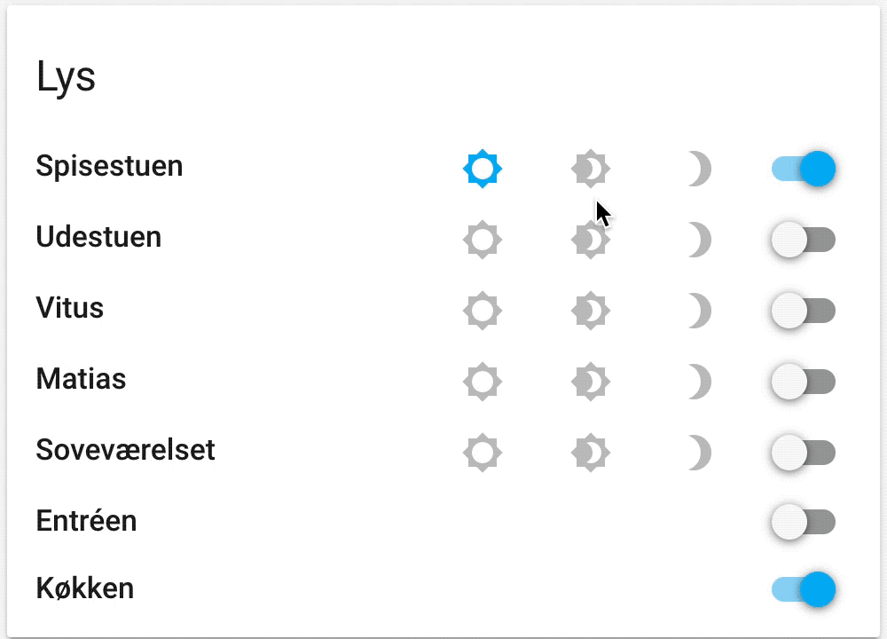

# Light with Profiles

[](https://github.com/hacs/integration)

Turn on lights based on `light_profiles.csv`.



## Installation

1. Upload `light-with-profiles.js` inside your `www` folder, and add the resource in lovelace config like so:

```yaml
resources:
  - type: module
    url: /local/light-with-profiles.js
```

2. If you like the card to be able to show wich profiles are active *(change color)* you will need to add your profiles defined in `light_profiles.csv` in your `lovelace.yaml` like so:

```yaml
light_profiles:
  bright: '0.457,0.408,254'
  dimmed: '0.457,0.408,77'
  nightlight: '0.509,0.411,1'
  brightness_only: '0,0,150'
```

3. Lastly add the custom card:

```yaml
type: 'custom:light-with-profiles'
title: Lys
entities:
  - entity: light.spisestuen
    name: 'Override Light Name'
    profiles:
      - name: bright
        icon: 'mdi:brightness-5'
      - name: dimmed
        icon: 'mdi:brightness-4'
      - name: nightlight
        icon: 'mdi:brightness-3'
  - entity: light.udestuen
    profiles:
      - name: bright
        icon: 'mdi:brightness-5'
      - name: dimmed
        icon: 'mdi:brightness-4'
      - name: nightlight
        icon: 'mdi:brightness-3'
  - entity: light.vitus
    profiles:
      - name: bright
        icon: 'mdi:brightness-5'
      - name: dimmed
        icon: 'mdi:brightness-4'
      - name: nightlight
        icon: 'mdi:brightness-3'
  - entity: light.matias
    profiles:
      - name: bright
        icon: 'mdi:brightness-5'
      - name: dimmed
        icon: 'mdi:brightness-4'
      - name: nightlight
        icon: 'mdi:brightness-3'
  - entity: light.sovevaerelset
    profiles:
      - name: bright
        icon: 'mdi:brightness-5'
      - name: dimmed
        icon: 'mdi:brightness-4'
      - name: nightlight
        icon: 'mdi:brightness-3'
  - entity: light.entreen
  - entity: light.kokken
```

## Debug

To show the current values of your lights you can add the `debug` attribute

```yaml
type: 'custom:light-with-profiles'
title: Lys
debug: true
entities:
  - entity: light.spisestuen
  - entity: light.entreen
  - entity: light.kokken
```

---
<a href="https://www.buymeacoffee.com/tcarlsen" target="_blank"></a>
